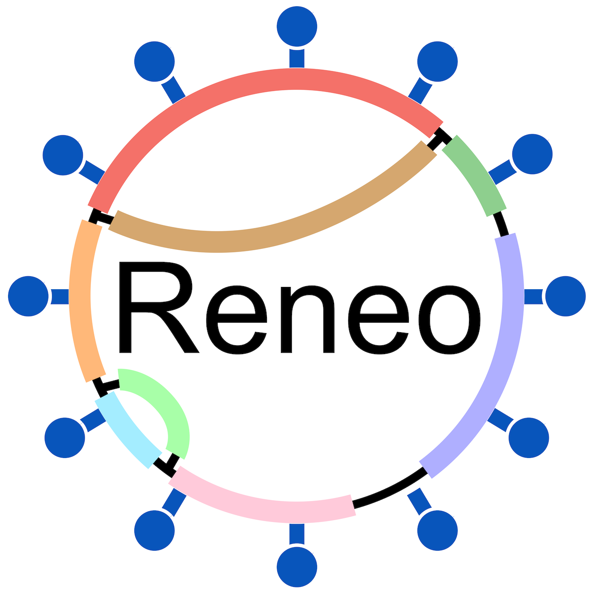

{width=40%}

# Reneo: Unraveling Viral Genomes from Metagenomes

[Reneo](https://en.wiktionary.org/wiki/reneo) means to *unravel* or *untangle* in Latin. Reneo is a software developed to unravel or untangle high-quality genomes from viral communities (including both prokaryotic and eukaryotic viruses) found within metagenomes using assembly graphs. Reneo identifies viral components in the metagenomic assembly using virus orthologous groups from [VOGDB](https://vogdb.org/), models as flow networks and solves a minimum flow decomposition (MFD) problem to resolve genomic paths. Reneo was motivated based on a bacteriophage recovery tool named [Phables](https://github.com/Vini2/phables), specifically to extend the capabilities of Phables to all viruses.
